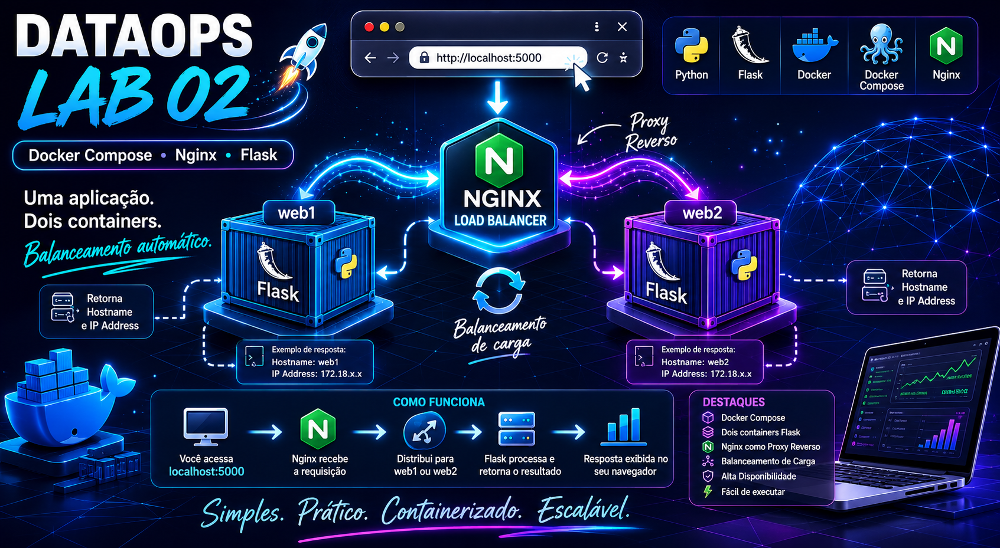

# Atividade 2 - DataOps (Faculdade Impacta)


Material de laboratório utilizado na disciplina de DataOps da Faculdade Impacta.

Nesta atividade o aluno aprenderá a executar uma aplicação Flask em containers Docker, orquestrar múltiplos serviços com Docker Compose e implementar balanceamento de carga utilizando Nginx como proxy reverso.




---

## O que você irá aprender

- Criação de imagens Docker com Dockerfile
- Execução de aplicações Flask em containers
- Orquestração de múltiplos serviços com Docker Compose
- Configuração de proxy reverso utilizando Nginx
- Balanceamento de carga entre containers
- Comunicação através de redes Docker
- Conceitos básicos de alta disponibilidade

---

## Arquitetura da Solução

A aplicação Flask é executada em duas instâncias independentes (`web1` e `web2`).

O Nginx atua como proxy reverso, recebendo as requisições dos usuários e distribuindo-as entre os containers disponíveis.

```text
                Navegador
            http://localhost:5000
                      │
                      ▼
             +----------------+
             |     NGINX      |
             | Load Balancer  |
             +--------+-------+
                      │
          +-----------+-----------+
          │                       │
          ▼                       ▼

      +--------+             +--------+
      | web1   |             | web2   |
      | Flask  |             | Flask  |
      +--------+             +--------+

            Docker Network
```

---

## Estrutura do Repositório

```text
.
├── app.py
├── Dockerfile
├── docker-compose.yml
├── nginx.conf
├── requirements.txt
├── .dockerignore
├── .gitignore
├── README.md
└── img_capa_atv2.png
```

| Arquivo | Descrição |
|----------|----------|
| `app.py` | Aplicação Flask que retorna hostname e IP do servidor |
| `Dockerfile` | Define a imagem Docker da aplicação |
| `docker-compose.yml` | Orquestra os containers Flask e Nginx |
| `nginx.conf` | Configuração do proxy reverso e balanceamento |
| `requirements.txt` | Dependências Python do projeto |
| `.dockerignore` | Arquivos ignorados durante o build |
| `.gitignore` | Arquivos ignorados pelo Git |
| `README.md` | Documentação do projeto |

---

## Descrição da Aplicação

A aplicação disponibiliza uma rota HTTP (`/`) que exibe:

- Hostname do container que processou a requisição
- Endereço IP do container

Exemplo:

```text
Hostname: flask_web1
IP Address: 172.18.0.3
```

---

## Containers do Ambiente

| Serviço | Função | Porta |
|----------|----------|----------|
| `web1` | Primeira instância da aplicação Flask | 5001 |
| `web2` | Segunda instância da aplicação Flask | 5002 |
| `nginx` | Proxy reverso e balanceador de carga | 5000 |

## Fluxo da Requisição

```text
Usuário
   │
   ▼
localhost:5000
   │
   ▼
NGINX
   │
 ┌─┴─┐
 ▼   ▼
web1 web2
   │
   ▼
Hostname + IP
```

Ao atualizar a página (F5), o Nginx poderá encaminhar a requisição para uma instância diferente da aplicação, demonstrando o funcionamento do balanceamento de carga.

---

# Execução Local

## Pré-requisitos

- Python 3.13 ou compatível
- Pip instalado

### Criar ambiente virtual (opcional)

```powershell
python -m venv .venv
.\.venv\Scripts\Activate.ps1
```

### Instalar dependências

```powershell
pip install -r requirements.txt
```

### Executar aplicação

```powershell
python app.py
```

### Acessar aplicação

Abra o navegador:

```text
http://localhost:5000
```

---

# Execução com Docker

## Construir imagem

```powershell
docker build -t meu-app .
```

## Executar container

```powershell
docker run -p 5000:5000 meu-app
```

## Acessar aplicação

```text
http://localhost:5000
```

---

# Execução com Docker Compose

## Iniciar ambiente

```powershell
docker compose up -d
```

## Verificar containers

```powershell
docker compose ps
```

Saída esperada:

```text
NAME            STATUS
flask_web1      running
flask_web2      running
nginx_proxy     running
```

## Acessar aplicação

Abra:

```text
http://localhost:5000
```

Você deverá visualizar algo semelhante a:

```text
Hostname: flask_web1
IP Address: 172.18.0.3
```

Agora pressione **F5** algumas vezes.

Observe que o hostname poderá alternar entre:

```text
Hostname: flask_web1
```

e

```text
Hostname: flask_web2
```

Isso ocorre porque o Nginx está distribuindo as requisições entre as duas instâncias da aplicação.

---

## Encerrar ambiente

```powershell
docker compose down
```

---

# Conceitos Trabalhados

Durante esta atividade são abordados os seguintes conceitos:

- Docker
- Dockerfile
- Docker Compose
- Containerização
- Redes Docker
- Flask
- Proxy Reverso
- Load Balancing
- Alta Disponibilidade
- Orquestração de Containers

---

# Exercícios Propostos

Após executar o laboratório, tente:

1. Alterar a mensagem retornada pela aplicação.
2. Adicionar uma terceira instância Flask no `docker-compose.yml`.
3. Modificar o algoritmo de balanceamento do Nginx.
4. Alterar a porta publicada pelo Nginx.
5. Personalizar a página HTML retornada pela aplicação.

---

# Solução de Problemas

## Porta 5000 já está em uso

Verifique qual processo está utilizando a porta:

```powershell
netstat -ano | findstr :5000
```

Ou altere a porta no `docker-compose.yml`.

---

## Container não inicia

Verifique os logs:

```powershell
docker compose logs
```

Ou:

```powershell
docker logs flask_web1
```

---

## Recriar containers após alterações

```powershell
docker compose down
docker compose up -d --build
```

---

# Conclusão

Esta atividade demonstra como transformar uma aplicação simples em uma arquitetura distribuída composta por múltiplos containers.

Embora seja um ambiente de laboratório, os conceitos apresentados são amplamente utilizados em plataformas modernas de desenvolvimento, DataOps, DevOps e aplicações em nuvem.